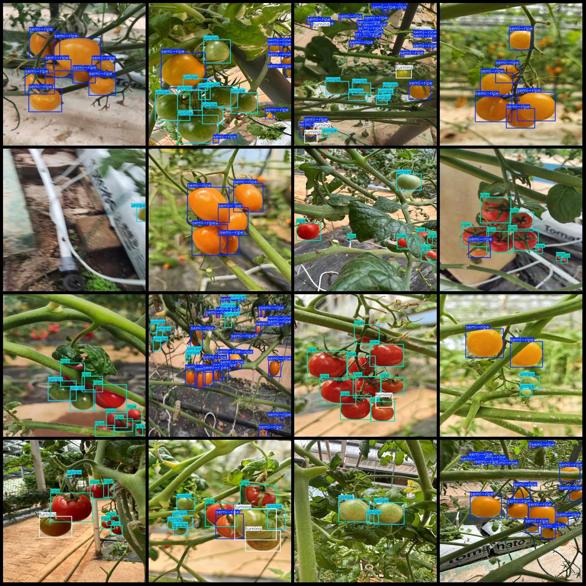
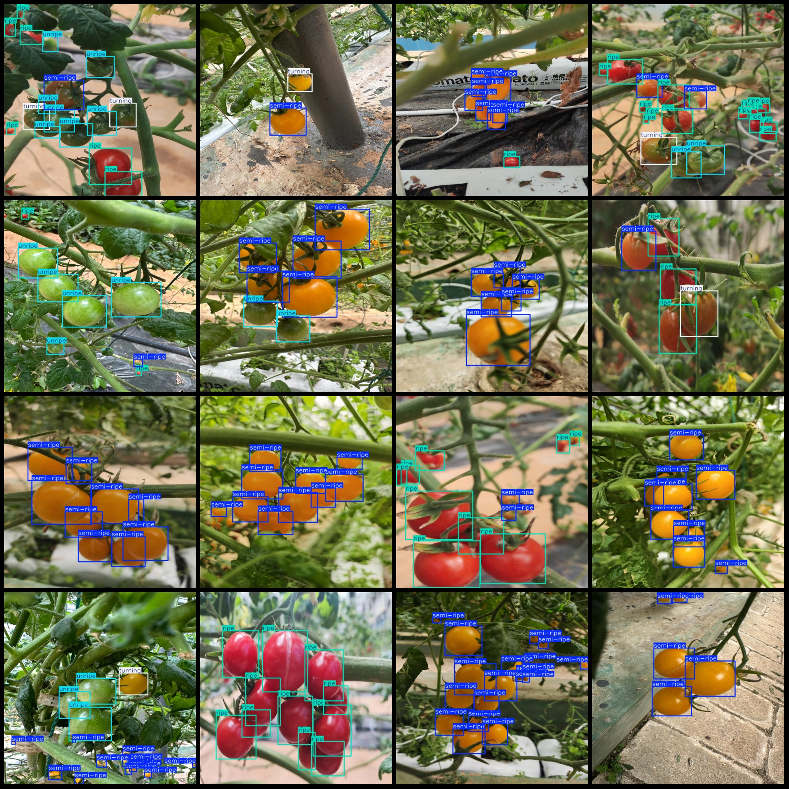

# Smart Agriculture Tomato Maturity Detection Dataset - VOC+YOLO Format with 1497 Images in 4 Categories

**Dataset Format:** Pascal VOC format + YOLO format (txt file without split path, only containing jpg images along with corresponding VOC format xml files and YOLO format txt files)

**Number of Images (jpg Files):** 1497

**Number of Annotations (xml Files):** 1497

**Number of Annotations (txt Files):** 1497

**Number of Annotation Categories:** 4

**Annotation Category Names (Note: the order of categories in YOLO format does not correspond to this, but is based on the labels folder 'classes.txt'):** ["ripe", "semi-ripe", "turning", "unripe"]

**Box Count per Category:**
- ripe (ripe) boxes = 3874
- semi-ripe (semi-ripe) boxes = 6596
- turning (turning) boxes = 979
- unripe (unripe) boxes = 2312

**Total Boxes:** 13761

**Image Resolution:** 640x640

**Annotation Tool Used:** labelImg

**Annotation Rules:** Draw a bounding box around each category

**Important Note:** The dataset does not have been split into training, validation, or test sets; it needs to be divided by the user.

**Special Disclaimer:** This dataset does not guarantee any precision in the trained model or weight files.

**Image Preview:**

## Images

Here is a pay link on Stripe ( https://buy.stripe.com/3cs8yP7sY87d0vu9AB ). Please contact me lonlonago@foxmail.com after funding $89, and I will send you a complete data files , thank you!

